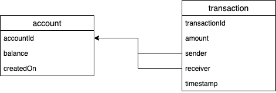

## Checking your environment

Make sure you have the following prerequisites installed:
  - [Java 8 JDK & JRE](https://docs.oracle.com/javase/8/docs/technotes/guides/install/install_overview.html)
  - [Maven](https://maven.apache.org/install.html)
  - [Docker](https://docs.docker.com/install/)

Make sure you do not have anything running on ports 5432 or 8080.  Once you have done so, start the database with:
```bash
$ ./start_db.sh
```

Then, either use your IDE to build and run the program using main class `ServiceApplication.java`, or build and run it in a new terminal window:
```bash
$ mvn install
$ java -jar "./target/platform-pair-envcheck-0.0.1-SNAPSHOT.jar" server configuration.yml
```

## Endpoints

#### Get account by id
```text
GET /account/get/{id}
```
This allows to get the information of a specific account, for example /account/get/A

sample response

```json
{
    "accountId": "A",
    "balance": 20,
    "createdOn": 1594157478715
}
```
#### Create a account 
```text
POST /account/create
```
This creates a new account and stored to the db whenever needed, required params are `accountId` and  `balance`

Sample response
```json
{
    "accountId": "E",
    "balance": 40,
    "createdOn": 1594162703107
}
```

#### Make a transaction between 2 accounts
```text
POST /transfer
```
This makes a transaction between account A and B, it requires the params of `senderID`, `receiverID` and the `amount`

Sample response
```json
{
    "transactionID": "828a31ab-8cf8-48a2-b61f-f7651dac35da",
    "amount": 20,
    "timestamp": 1594162623078,
    "sender": {
        "accountId": "B",
        "balance": 160,
        "createdOn": 1594157478716
    },
    "receiver": {
        "accountId": "A",
        "balance": 20,
        "createdOn": 1594157478715
    }
}
```
## Database
When building the DB docker, it will create 2 tables with the following relationship:


 <br/>

After the table is created, it will populate 2 accounts with different IDs into the account table. If the data is not enough, user can use create endpoint to manually create accounts.
